# Nonton ID

Aplikasi pemesanan tiket film


## Getting Started

Pastikan sudah menginstall Git dan Flutter pada environment kalian.


### Prasyarat

- Flutter
  ```sh
  https://docs.flutter.dev/get-started/install
  ```
- Git
  ```sh
  https://git-scm.com/downloads
  ```

### Instalasi

1. Clone the repo
   ```sh
   git clone https://github.com/arisuryar/nonton_id
   ```
2. Install the dependencies
   ```sh
   flutter pub get
   ```
3. Configurasi Project dengan Firebase
   ```sh
   https://firebase.google.com/docs/flutter/setup
   ```
4. Buat akun TMDB
   ```sh
   https://www.themoviedb.org/
   ```
   jika sudah ke halaman profile dan pilih pengaturan, kiri bawah pilih API dan copy API Read Access Token,
   lalu masuk ke (lib/core/constant/config.dart) dan pastekan pada _token.

5. Run
   ```sh
   Run Without Debugging On Vs Code
   ```


## Detail Aplikasi Nonton ID
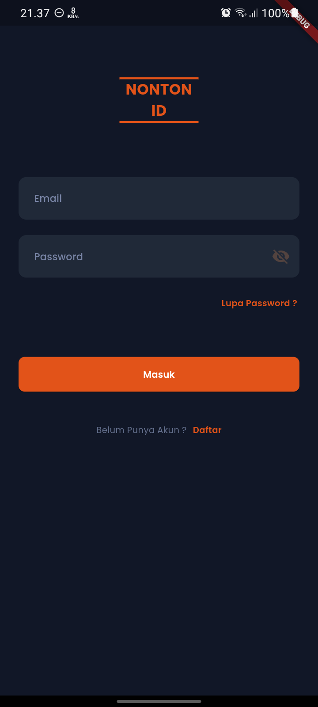&nbsp;&nbsp;
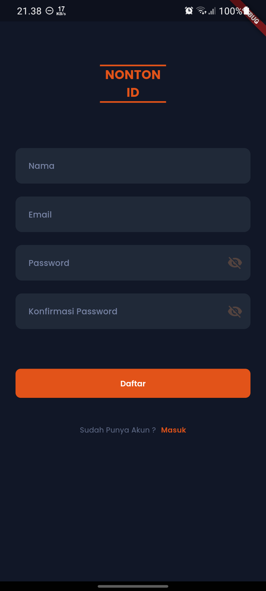&nbsp;&nbsp;
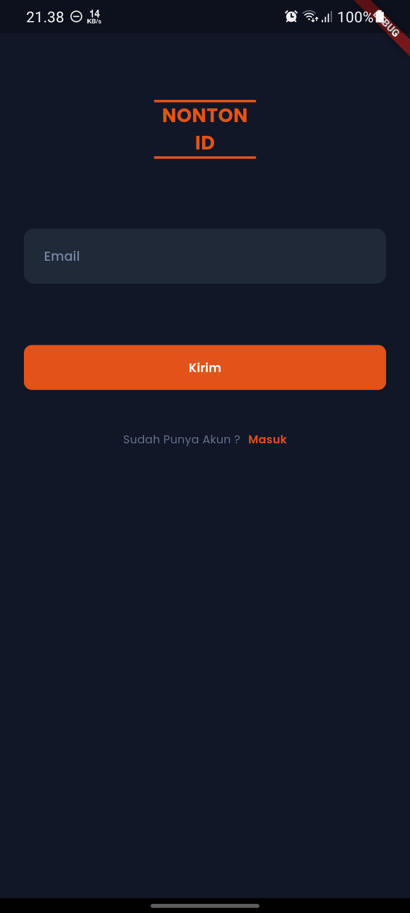&nbsp;&nbsp;

&nbsp;&nbsp;
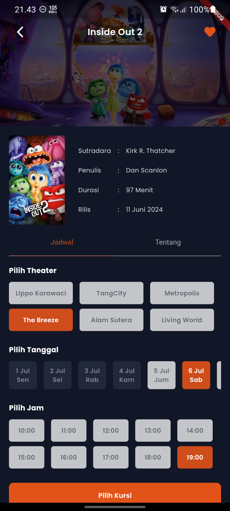&nbsp;&nbsp;
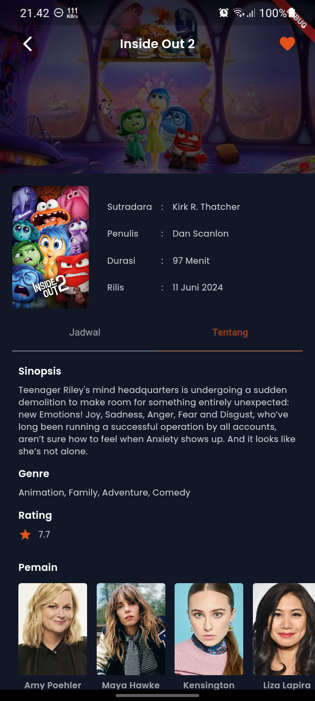&nbsp;&nbsp;

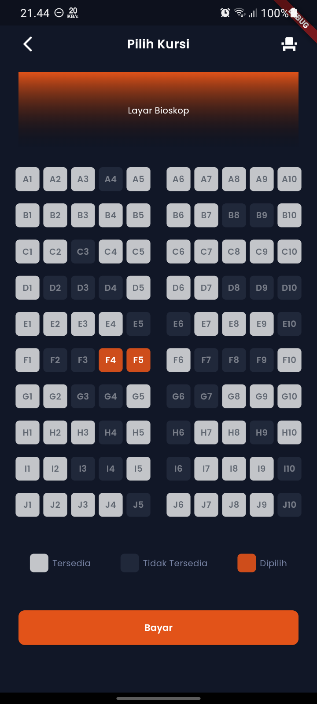&nbsp;&nbsp;
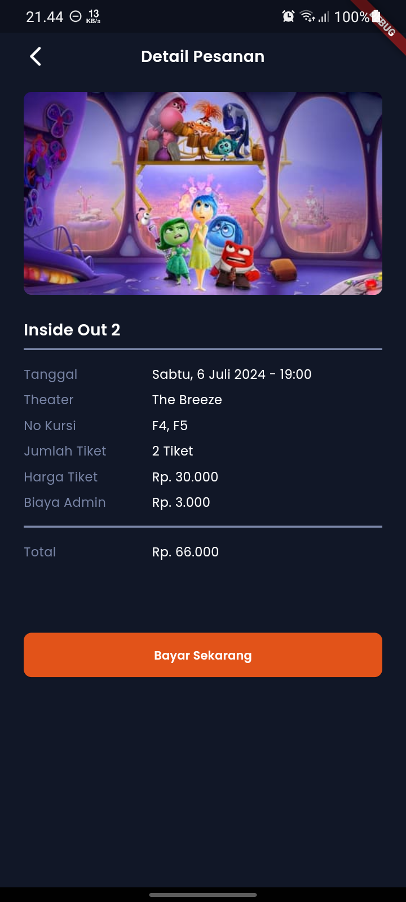&nbsp;&nbsp;
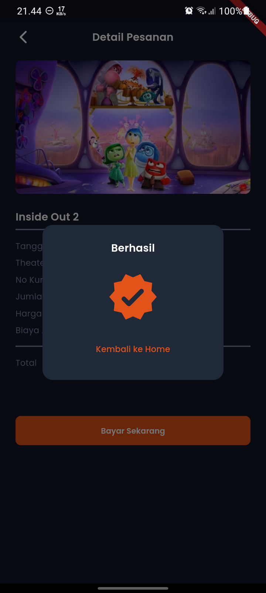&nbsp;&nbsp;

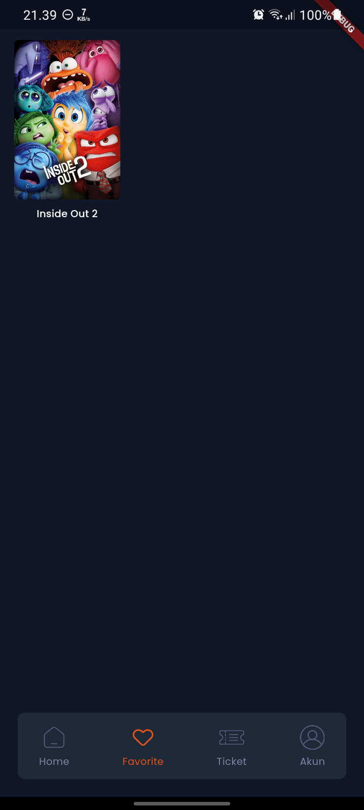&nbsp;&nbsp;
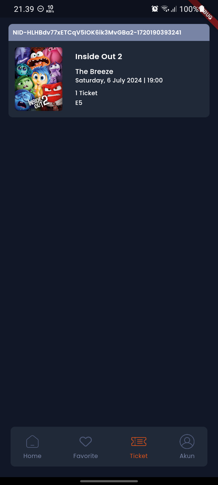&nbsp;&nbsp;
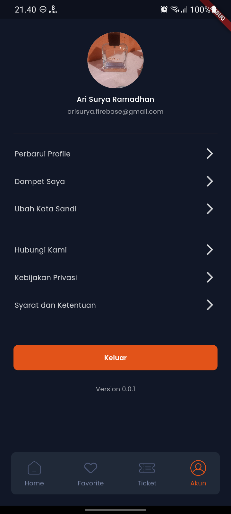&nbsp;&nbsp;

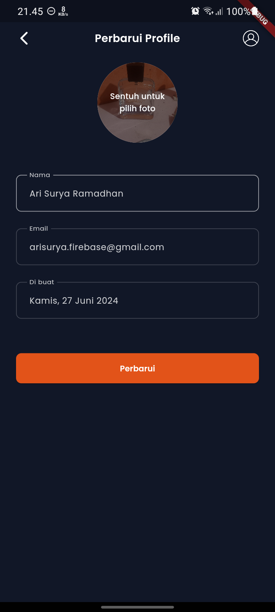&nbsp;&nbsp;
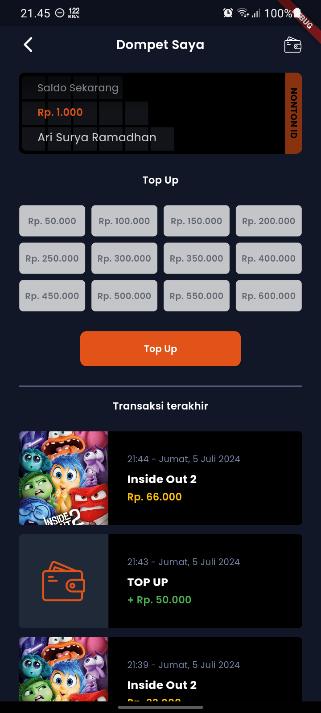&nbsp;&nbsp;
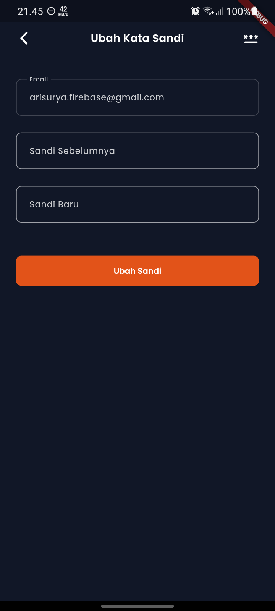&nbsp;&nbsp;